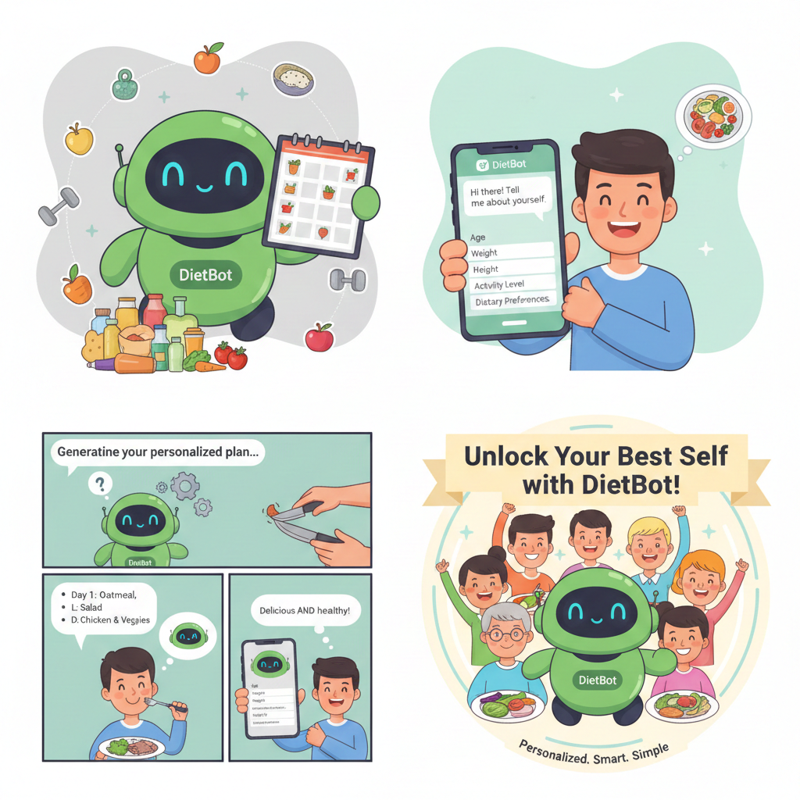
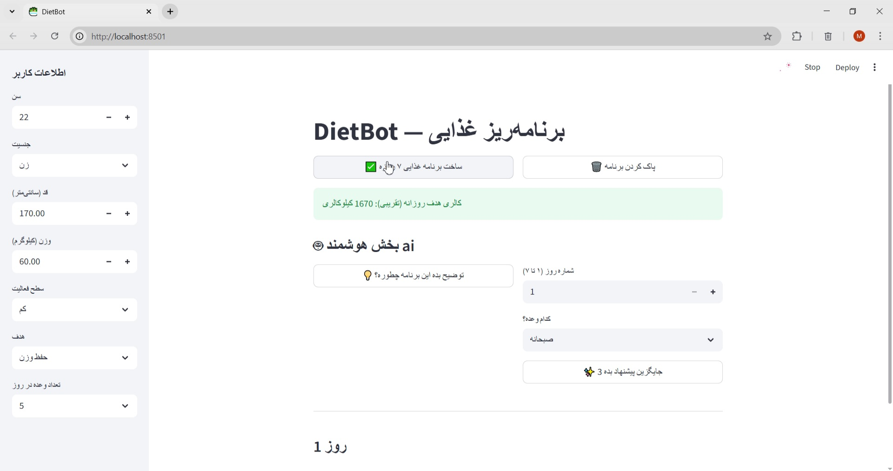
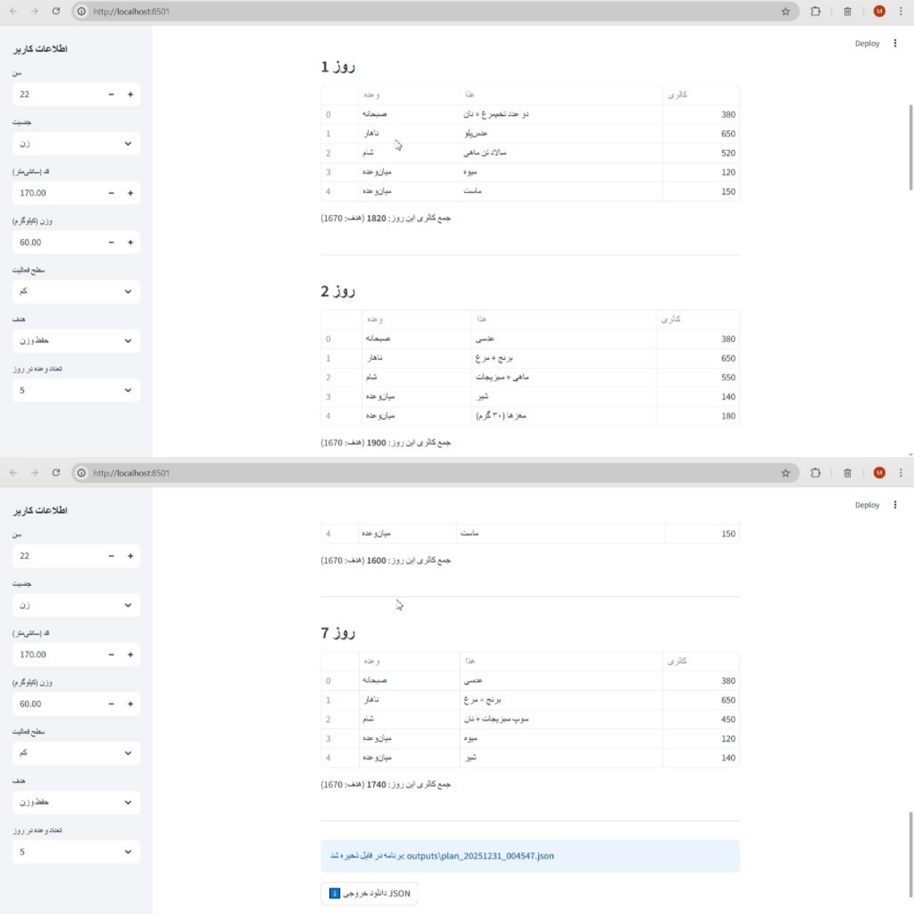
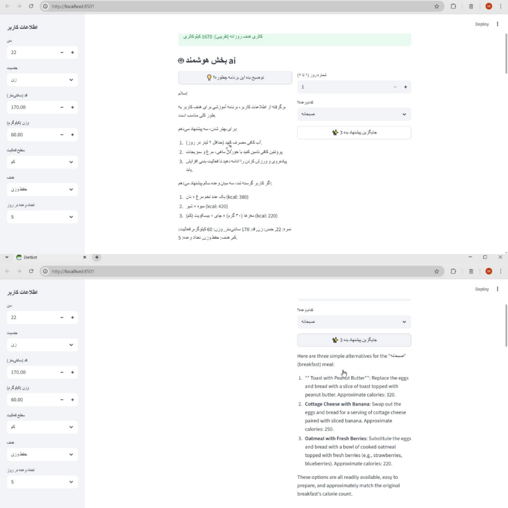

# 🥗 DietBot

## Design and Implementation of a Personalized Diet Recommendation System


---

## 🎓 Academic Information

- **University:** Islamic Azad University, Tehran Central Branch
- **Field of Study:** Computer Science
- **Course:** Artificial Intelligence
- **Project Type:** Undergraduate Academic Project
- **Instructor:** Dr. Maryam Hajiesmaeili
- **Project Title:** DietBot – Personalized Diet Recommendation System

---

## 👥 Project Team & Responsibilities

| Name                    | Academic Role                               | Technical Responsibility                                                                                                                                                                |
|-------------------------|---------------------------------------------|-----------------------------------------------------------------------------------------------------------------------------------------------------------------------------------------|
| Aylar Kazempour         | Lead System Analyst & Algorithm Architect   | End-to-end problem modeling, design of nutritional algorithms, BMR/TDEE formulation, goal-based calorie optimization logic, and validation of algorithmic correctness (`diet_logic.py`) |
| Mahshid Shoaibi         | Backend Logic Developer                     | Implementation of metabolic calculations, edge-case handling, and integration of algorithmic logic with system workflow (`diet_logic.py`)                                               |
| Nastaran Moradi         | Frontend & UI Developer                     | Design and implementation of the interactive Streamlit interface, user input validation, and output visualization (`app.py`)                                                            |
| Mahsa Deylami           | Data Architect                              | Design and normalization of food datasets, calorie annotation, and meal categorization (`foods.py`)                                                                                     |
| Mohammad Rasool Miraki  | Project Manager & System Integrator         | Module coordination, utility functions, data persistence, and generation of explanatory textual outputs (`utils.py`, `ai.py`)                                                           |

---

## 1. Introduction

Diet and nutrition management is a critical aspect of maintaining a healthy lifestyle. However, many individuals lack the technical or scientific knowledge required to calculate daily caloric needs, understand metabolic rates, or design a balanced diet aligned with personal goals such as weight loss, weight maintenance, or weight gain.

**DietBot** is an academic software project designed to address this challenge by providing an automated, user-friendly, and educational system that generates personalized diet plans based on fundamental physiological and lifestyle parameters.

The project focuses on applying software engineering principles, modular programming, and algorithmic problem-solving rather than clinical or medical deployment.

---

## 2. Problem Definition

Existing diet-planning solutions often suffer from at least one of the following limitations:

- Dependence on paid services or subscriptions
- Complex user interfaces unsuitable for non-expert users
- Overly medicalized approaches not intended for educational use

This project aims to design a **lightweight, transparent, and accessible system** that enables users to better understand their nutritional needs while demonstrating academic concepts in software development.

---

## 3. Project Objectives

The primary objectives of DietBot are:

- To collect basic physical and lifestyle data from users
- To analyze metabolic and caloric requirements using standard formulas
- To adjust caloric intake based on dietary goals
- To generate a structured and personalized weekly diet plan
- To present results in a clear, interpretable, and educational manner

---

## 4. System Architecture Overview

DietBot is implemented as a modular Python-based application following a clear separation of concerns:

```
DietProjekt/
│
├── app.py          # User interface and interaction handling (Streamlit)
├── diet_logic.py   # Metabolic calculations and diet planning algorithms
├── foods.py        # Food database and meal categorization
├── ai.py           # Textual explanation and recommendation generation
├── utils.py        # Utility functions and output persistence
└── .venv/          # Python virtual environment
```

Each module is independently designed and tested to ensure maintainability and extensibility.

---

## 5. Functional Workflow

### 5.1 User Input Collection

The system collects the following parameters through a graphical interface:

- Age
- Gender
- Height
- Weight
- Physical activity level
- Dietary goal (weight loss, maintenance, or gain)
- Number of daily meals

### 5.2 Metabolic and Caloric Analysis

Using well-established nutritional formulas, the system calculates:

- **Basal Metabolic Rate (BMR)**
- **Total Daily Energy Expenditure (TDEE)**

These calculations are implemented in `diet_logic.py` and serve as the foundation for diet planning.

### 5.3 Goal-Based Decision Logic

Based on the user's goal:

- A caloric deficit is applied for weight loss
- A caloric surplus is applied for weight gain
- No adjustment is applied for weight maintenance

This represents the core algorithmic decision-making process of the system.

### 5.4 Meal Planning and Allocation

The `foods.py` module:

- Defines food items with approximate caloric values
- Categorizes foods by meal type (breakfast, lunch, dinner, snacks)
- Distributes calories across meals and days with controlled randomness

### 5.5 Output Generation and Explanation

The final output consists of:

- A complete weekly diet plan
- Daily meal breakdowns
- Explanatory text describing the rationale behind the plan

The `ai.py` module is responsible for generating user-friendly textual explanations.

### 5.6 Data Persistence

The system supports saving generated diet plans using helper functions implemented in `utils.py`.

---

## 6. Technologies and Libraries

### Python

The primary programming language used for implementing business logic, data processing, and system coordination.

### Streamlit

- **Usage Location:** `app.py`
- **Purpose:** Rapid development of an interactive web-based interface without requiring front-end frameworks.

### Standard Python Libraries

- `math` – metabolic and caloric calculations
- `random` – controlled variation in meal selection
- `json` – structured data storage and export

---

## 7. External APIs

No external APIs are used in the current version of DietBot. The system is fully offline and self-contained, making it suitable for academic demonstration and local execution.

---

## 8. How to Run the Project

### Step 1: Clone the Repository

```bash
git clone <repository-url>
cd DietBot
```

### Step 2: Create Virtual Environment (Recommended)

```bash
python -m venv .venv
```

Activate the environment:

- **Windows:**

```bash
.venv\Scripts\activate
```

- **macOS / Linux:**

```bash
source .venv/bin/activate
```

### Step 3: Install Dependencies

```bash
pip install streamlit
```

### Step 4: Run the Application

```bash
python -m streamlit run app.py
```

The application will open in the browser at:

```
http://localhost:8501
```

---

### 📸 8.2 Project Output

The following screenshots illustrate the main execution stages of the DietBot system and demonstrate its actual functionality.

### System Execution Screenshots



*User input acquisition and display of the calculated target calorie intake*



*Presentation of the generated 7-day personalized diet plan*



*AI-based explanation module providing detailed insights and alternative meal suggestions*

### System Demonstration Video

[Watch Demo Video](assets/demo.mp4)


---

## 9. Limitations

- The generated diet plans are for **educational purposes only**
- Caloric values are approximate
- The system is not intended for clinical or medical use
- Does not replace consultation with certified nutritionists or healthcare professionals

---

## 10. Future Work

Potential extensions of the project include:

- Integration with external nutrition APIs
- User profile persistence and history tracking
- BMI and body composition analysis
- Machine learning–based recommendation enhancements

---

## 11. Conclusion

DietBot demonstrates how fundamental principles of software engineering, algorithm design, and data modeling can be applied to a real-world problem in the domain of nutrition. The project successfully bridges theoretical academic concepts with a practical, extensible software solution.

---

**Developed by:** Computer Science Students **Purpose:** Academic and Educational Use Only

