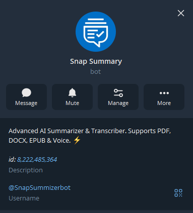
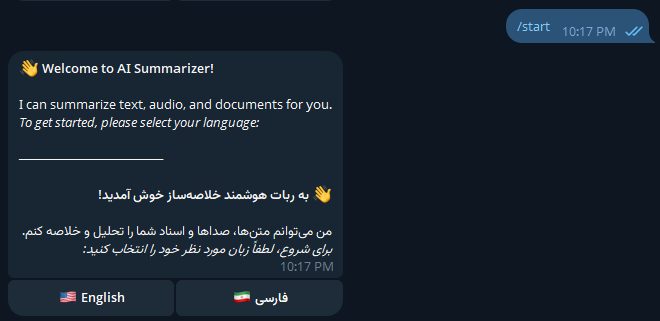
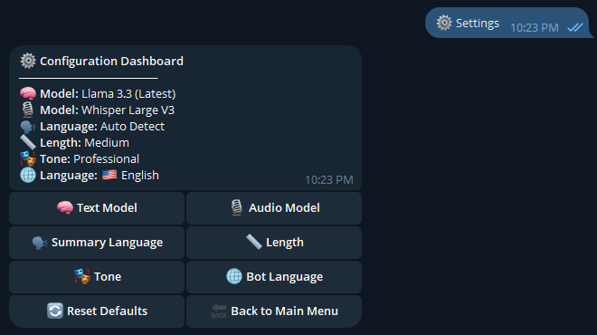
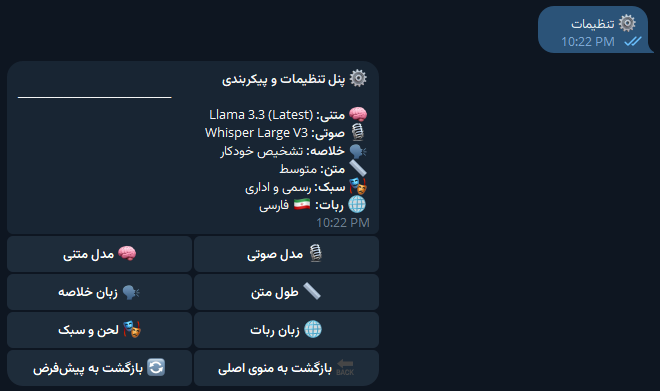
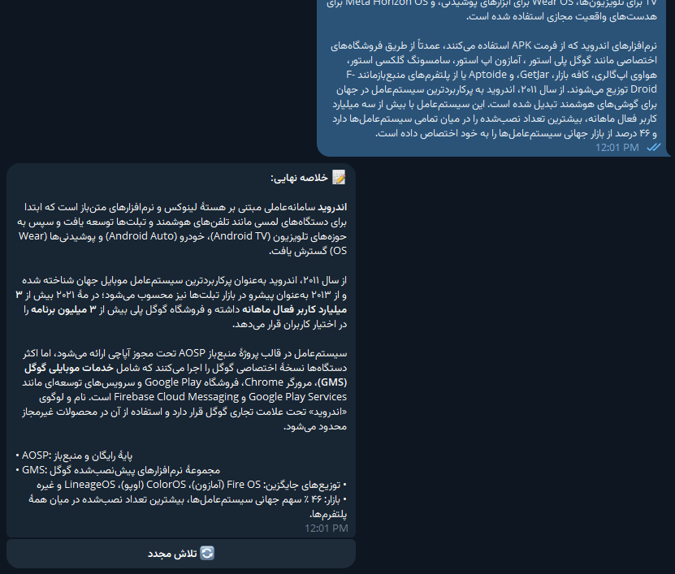
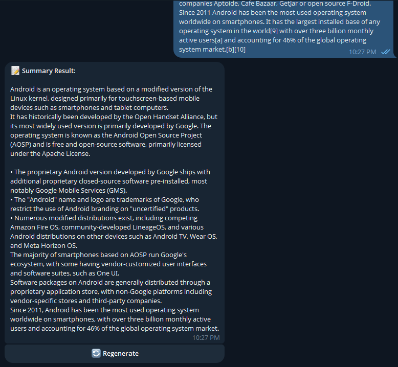
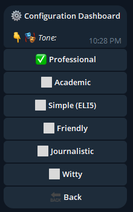
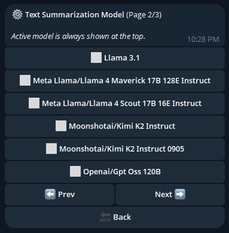
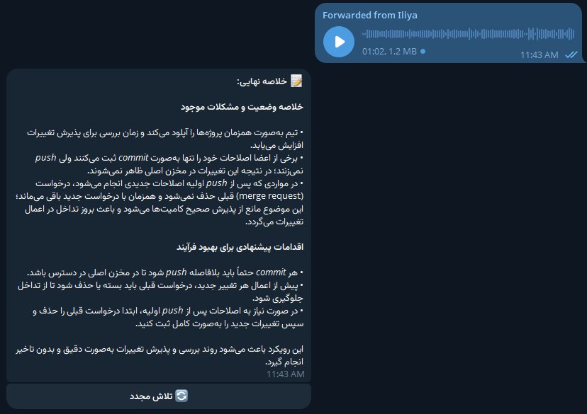

# 🚀 Advanced AI Summarizer & Transcriber Bot


A high-performance, asynchronous Telegram bot designed to break down language barriers and summarize complex content instantly. Powered by the **Groq Inference API**, this bot leverages state-of-the-art LLMs (Llama 3.3, Mixtral, DeepSeek) and Whisper V3 to provide human-level text analysis and audio transcription.

## ✨ Key Features

### 🧠 Intelligent Summarization
* **Multi-Model Support:** Switch dynamically between top-tier models like **Llama 3.3 70B**, **Mixtral 8x7B**, **Gemma 2**, and **DeepSeek R1**.
* **Context Aware:** Paste long articles, news, or messages directly into the chat for instant analysis.
* **Customizable Output:**
    * **Tone:** Choose from Professional, Academic, ELI5 (Simple), Friendly, Journalistic, or Witty.
    * **Length:** Select Short (Bullets), Medium, or Long (Detailed) summaries.
    * **Creativity:** Adjust temperature settings for Precise or Creative results.

### 📄 Universal Document Processing
* **File Support:** Upload **PDF**, **DOCX**, **EPUB**, or **TXT** files.
* **Smart Extraction:** Automatically cleans formatting, removes HTML artifacts, and extracts readable text from complex documents.

### 🎙️ Audio Intelligence (Whisper V3)
* **Voice & Audio:** Forward voice notes or upload audio files (`.mp3`, `.ogg`, `.wav`, `.m4a`, etc.).
* **Transcription:** Uses **Groq's Whisper V3** (Large/Turbo) for near-perfect speech-to-text conversion before summarizing.

### 🌐 Bilingual & User-Friendly
* **Dual Interface:** Fully localized for **English 🇺🇸** and **Persian (Farsi) 🇮🇷**.
* **Auto-Translation:** Can detect input language and force the summary output into English, Persian, Spanish, French, German, Russian, Arabic, Turkish, or Chinese.
* **Interactive Dashboard:** A robust inline settings menu to configure preferences without typing commands.

---

## 🛠️ Tech Stack

* **Core:** Python 3.10+
* **Framework:** `python-telegram-bot` (Async)
* **AI Engine:** [Groq Cloud API](https://groq.com/)
* **Database:** SQLite + `aiosqlite` (Asynchronous non-blocking storage)
* **File Processing:** `pypdf`, `python-docx`, `ebooklib`, `BeautifulSoup4`

## 📸 Screenshots



















---

## 🚀 Installation & Setup

### Prerequisites
1.  **Python 3.10** or higher.
2.  A **Telegram Bot Token** (from [@BotFather](https://t.me/BotFather)).
3.  A **Groq API Key** (from [Groq Console](https://console.groq.com/)).

### 1. Clone the Repository
```bash
git clone https://github.com/yourusername/ai-summarizer-bot.git
cd ai-summarizer-bot
```

### 2. Set Up Virtual Environment
It is recommended to use a virtual environment to manage dependencies.

```bash
# Windows
python -m venv venv
venv\Scripts\activate

# Linux/Mac
python3 -m venv venv
source venv/bin/activate
```

### 3. Install Dependencies
```bash
pip install -r requirements.txt
```

### 4. Configuration
Create a `.env` file in the root directory to store your sensitive API keys.

```bash
# Create .env file
touch .env
```

Open `.env` and add the following:
```ini
TELEGRAM_BOT_TOKEN=your_telegram_token_here
GROQ_API_KEY=your_groq_api_key_here
```

### 5. Run the Bot
```bash
python bot.py
```

---

## 📂 Project Structure

```text
.
├── bot.py                 # Application entry point & lifecycle management
├── config.py              # Configuration, System Prompts, & Model Constants
├── database.py            # Async SQLite database wrapper
├── requirements.txt       # Project dependencies
├── .env                   # API Keys (Gitignored)
├── handlers/              # Command and Event Handlers
│   ├── start.py           # Onboarding & Main Menu
│   ├── messages.py        # Text summarization & Redo logic
│   ├── files.py           # Document & Audio processing
│   └── settings.py        # Interactive Settings Dashboard
└── utils/
    ├── i18n.py            # Localization (En/Fa strings)
    └── text_processing.py # File extraction & HTML sanitization
```

---

## ❓ Troubleshooting

| Issue | Possible Cause | Solution |
| :--- | :--- | :--- |
| **Bot not responding** | Invalid Token or Script not running | Check `.env` token and ensure `python bot.py` is active. |
| **"API Error"** | Groq API Key invalid or Quota exceeded | Check your Groq Console for rate limits. |
| **"File Error"** | Corrupt file or Unsupported extension | Ensure file is PDF, DOCX, EPUB, or standard Audio (MP3/OGG/WAV). |
| **Audio not transcribing** | File too large | Groq has a file size limit (approx 25MB). Compress audio if necessary. |

---

## 👥 Authors

1.  **Alireza Alem**
2.  **Nadia Karami**
3.  **Melina Malakjan**
4.  **Elahe Bakhtiary**
5.  **Mahmoud Sheibani**

---

## 📄 License

This project is licensed under the **MIT License**.